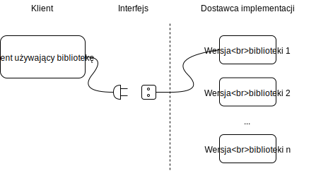
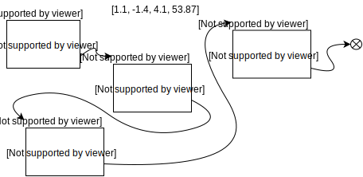

#  seminarium 11

1. Przypominamy szybko obliczanie wartości wielomianu na tablicach zaalokowanych dynamicznie
2. Przypominamy śledzenie wycieków pamięci za pomocą valgrind
3. Poprawiamy wydajność alokacji pamięci - nie realookujemy przy każdym dodaniu elementu, ale preallokujemy porcjami, za każdym razem dwa razy zwiększając rozmiar preallokowanej porcji,
    * potrzebujemy struktury `Wektor`, aby poprawić czytelność programu, ponieważ zwiększy nam się ilość informacji o wektorze,
    * w strukturze oprócz samych wartości i rozmiaru wektora (`n` - ilość liczb) zapamiętamy bieżący rozmiar zaalokowanej pamięci, która zawsze będzie większa lub równa zaalokowanej porcji pamięci,
    * utworzymy funkcję do inicjowania wektora (celem jest zamknięcie wielokrotnie używanych zadań w funkcje) - `vec_init`,
    * utworzymy funkcję do dodawania elementu do wektora (`vec_push`),
    * do wstawiania wartości na zadanej pozycji,
    * do usuwania ostatniego elementu (pop).
    Tym samym zaimplementujemy strukturę danych typu stos.
4. Przerabiamy program do liczenia wartości wielomianu za pomocą listy jednokierunkowej (skupiamy się na pokazaniu pisania funkcji do tworzenia, czyszczenia, itp.)
5. Spróbujmy teraz napisać (zaprojektować) jednolity interfejs do naszych zbiorów danych.
    * wyjaśnić pojęcie interfejsu (chcemy mieć łatwo wymienialny moduł implementujący zarządzanie wektorami)


## Struktura PVec

Na początku przerobimy program tak aby wektor przechowywał w sobie więcej informacji:

* same dane (czyli tablice liczb typu double),
* swój rozmiar,
* rozmiar zarezerwowanej tablicy w pamięci operacyjnej z ewentualnym miejscem na dodawanie kolejnych elementów.

Zacznijmy od pliku nagłówkowego, w którym zdefiniujemy naszą strukturę.

```c
#include <stdio.h>
#include <math.h>

typedef struct _Vec {
    int n;
    int _size;
    double *items;
} Vec, *PVec;

PVec vec_new(int size);
void vec_free(PVec v);
void vec_append(PVec v, double d);
PVec vec_read(FILE * fin);
void vec_print(FILE * stream, PVec vec);
void vec_save2(FILE * fout, PVec x, PVec y);
PVec polyval_horner(PVec a, PVec x);
```

W pliku nagłówkowym od razu zmodyfikowaliśmy argumenty do funkcji naszej biblioteki. Zamiast za każdym razem podawać parę `double *v, int n`, po podajemy jeden argument:  `PVec v`.

W kolejnym etapie zacznijmy od implementacji tworzenia nowego, pustego wektora.

```c
PVec vec_new(int size) {
    debug("Tworzę nowy wektor używając STRUKTURY. Podany rozmiar początkowy: %d\n", size);
    PVec v = (PVec) malloc(sizeof(Vec));
    v->n = size;
    if (size > 0)
        v->items = (double*) malloc(sizeof(double) * size);
    v->_size = size;

    return v;
} 
```

Funkcja przyjmuje jeden argument - początkowy rozmiar wektora. Jeżeli podamy początkowy rozmiar wektora to funkcja automatycznie zarezerwujemy pamięć operacyjną dla wartości. Nie zainicjujemy ich żadnymi wartością - będą tam tzw. śmieci, ale będziemy mieć zarezerwowaną od razu pamięć.

Na początku rezerwujemy pamięć dla struktury, a następnie inicjujemy jej pola.

Później napiszmy funkcję wczytującą. Dla wygody utworzymy funkcję dodającą nowy element do wektora - to jest właśnie ta funkcja (`vec_append`), która będzie inteligentniejsza. Na początku sprawdza ona, czy przypadkiem nasz bufor na wartości w wektorze `v`, nie jest przypadkiem już pełny. Jeżeli jest pełny to obliczamy nowy rozmiar, który jest dwa razy większy od obecnego (lub używamy rozmiaru 1, gdy wektor jest pusty).  rezerwujemy pamięć dla nowego wektora liczby typu double (`double*`). Kopiujemy wcześniejsze wartości używając systemowej funkcji `memcpy` - wymagane dołączenie biblioteki `string.h` :-). Zwalniamy pamięć (`free`) po starym buforze i przypisujemy nowy w polu naszego wektora. Pamiętamy aby ustawić nowy rozmiar bufora liczb. Na końcu, dodajemy nową wartość na `n`-tej pozycji (`v->items[ v->n ] = d;`). Pamiętajmy, że tą nową wartość dopiszemy na n-tej pozycji albo w starym buforze - gdy mieliśmy jeszcze miejsce, albo już w nowym.

```c
void vec_append(PVec v, double d) {
    if (v->_size == v->n) {
        int newsize = v->_size == 0 ? 1 : v->_size * 2;
        double * newitems = (double*) malloc(sizeof(double) * newsize);
        if (v->_size > 0) {
            memcpy(newitems, v->items, v->_size * sizeof(double));
            free(v->items);
        }
        v->items = newitems;
        v->_size = newsize;
    }
    v->items[ v->n ] = d;
    v->n += 1;
} 
```

Zobaczmy jak czytelnie i prosto będzie wyglądać nasza funkcja do wczytywania! Zwróćmy uwagę, że przy odrobinie wprawy jesteśmy w stanie przeczytać poniższy kod jak książkę (tylko po polsko-angielsku): 

* `v` staje się `vec_new(0)`
* `while` (`fscanf` wczytało 1 nową liczbę do zmiennej `d` z pliku `fin`)
  * `vec_append(v, d)`
* `return v`

```c
PVec vec_read(FILE * fin){
    double d;
    PVec v = vec_new(0);

    while ( fscanf(fin, "%lf", &d) == 1 )
        vec_append(v, d);

    return v;
}
```

Zapisywanie do plików i na ekran jest proste. Nie będziemy tego tłumaczyć ;-)

```c
void vec_print(FILE * out, PVec vec) {
    int i;
    fprintf(out, "[");
    for (i=0; i < vec->n; i++) 
        fprintf(out, "%f%s", vec->items[i], i < (vec->n-1) ? "," : "");
    fprintf(out, "]\n");
}

void vec_save2(FILE * fout, PVec v1, PVec v2) {
    int i;
    for (i = 0; i < MIN(v1->n, v2->n); i++) {
        fprintf(fout, "%lf, %lf\n", v1->items[i], v2->items[i]);
    }
}
```

Schemat Hornera niewiele się zmienia - wygląda niestety bardziej skomplikowanie, ponieważ musimy odwoływać się do pól struktur `Vec`. Ale, przy odrobinie wprawy nie jest tak źle…

```c
/*
Schemat Hornera - redukcja błędu zaookrągleń
*/
PVec polyval_horner(PVec a, PVec x) {
    int i, j;    
    PVec f = vec_new(x->n);

    debug("Liczę schematem Hornera.\n");
    for (i=0; i < x->n; i++) {
        f->items[i] = a->items[a->n - 1];
        for (j = a->n - 2; j >=  0; j--) {
            f->items[i] = a->items[j] + x->items[i] * f->items[i];
        }
    }

    return f;
}
```


## Interfejs

Interfejs odnosi się do wielu elementów w inżynierii komputerowej i oprogramowania. Zasadniczo najważniejszymi definicjami są:

* interfejs komunikacyjny w ujęciu sprzętu komputerowego (porty USB, USB-C, micro USB, szeregowe, gniazda rozszerzeń na płytach głównych),
* interfejs użytkownika w ujęciu gotowego oprogramowania oznacza sposób komunikacji użytkownika z programem (metody przekazywania do programu instrukcji oraz odczytywania przez użytkownika wyników),
* interfejs API (ang. Application Programming Interface) - w dzisiejszych czasach często odnoszący się do programów sieciowych - zbiór adresów sieciowych i definicja komunikacji z nimi aby uzyskać jakiś efekt na serwerze internetowym (przykład użycia curl),
* interfejs programistyczny z punktu widzenia modułu oprogramowania - czyli zbiór typów danych zdefiniowanych przez jakąś bibliotekę i reguł posługiwania się funkcjami tej biblioteki; z punktu widzenia języka `C` takim interfejsem może być plik (lub ich zbiór) plik nagłówkowy.

Celem tworzenia interfejsu jest udostępnienie tzw. architektury modułowej (lub nawet komponentowej), która polega na tym, że moduły komunikują się ze sobą za pomocą określonych protokółów (procedur)  i wykorzystując specyficzne typy danych bez wnikania kto z nami rozmawia po drugiej stronie interfejsu.



Rys. 1. Idea interfejsu komunikacyjnego

W ramach seminarium postaramy się stworzyć jednolity interfejs do operowania na strukturach danych reprezentujących wektor. Stworzymy uniwersalną bibliotekę danych i będziemy wymieniać tylko wariant wewnętrznej implementacji. Struktura plików będzie następująca:

```bash
main.c                              # główny program sterujący
bibl_vec.c bibl_vec.h               # biblioteka wykonująca nasze operacje na wektorach
bibl_vec_array.c bibl_vec_array.h   # wariant implementacji wykorzystujący dynamicznie alokowaną tablicę liczby typu double
bibl_vec_list.c bibl_vec_list.h     # wariant implementacji wykorzystujący jednokierunkową listę dynamiczną
utils.h                             # wspólne narzędzia wykorzystywane w projekcie
```

Będziemy chcieli wybierać rodzaj implementacji w jednym miejscu - w pliku makefile. Do tego celu wykorzystamy stała makrodyrektywę: `#define VEC_LIST`. Czyli w kodzie będziemy sprawdzać, która wersja jest wybrana za pomocą `#ifdef`.

Głównym wyzwaniem postawionym przed nami jest taka 'sprytna' implementacja aby zmieniać tylko jedną linijkę w makefile'u. Zmiana ta nie powinna wymagać jakichkolwiek innych zmian w reszcie kodu, a zwłaszcza w pliku zawierającym funkcję `main`. 

W tym celu utworzymy plik `bibl_vec.h`, który będzie zawierać **interfejs** do naszej biblioteki oraz będzie wybierać stosowną strukturę danych 

```c
#ifndef _BIBL_VEC_H
#define _BIBL_VEC_H

#include <stdio.h>
#include <math.h>

#ifdef VEC_LIST
    #include "bibl_vec_list.h"
#else
    #include "bibl_vec_array.h"
#endif

PVec vec_new(int size);
void vec_free(PVec v);
void vec_append(PVec v, double d);
PVec vec_read(FILE * fin);
void vec_print(FILE * stream, PVec vec);
void vec_save2(FILE * fout, PVec x, PVec y);
PVec polyval_horner(PVec a, PVec x);

#endif
```

Implementacja używająca wektora niewiele się zmienia - prawie wcale. Musimy tylko *zorganizować się odpowiednio* w naszych plikach. Co ważne, plik nagłówkowy wersji z tablicą (*ang. array*) będzie zawierać tylko definicję struktury. Dodatkowo, udekorujemy nasze pliki nagłówkowe standardową dekoracją zapobiegającą wielokrotnemu dołączaniu tego samego pliku nagłówkowego podczas kompilacji ([https://pl.wikipedia.org/wiki/Plik_nag%C5%82%C3%B3wkowy](https://pl.wikipedia.org/wiki/Plik_nagłówkowy)):

```c
# plik.h
#ifndef _PLIK_H
#define _PLIK_H
...
#endif
```

Zatem plik `bibl_vec_array.h` przyjmie bardzo krótką postać jak poniżej. Pamiętajmy, że funkcje biblioteki będą zdefiniowane w głównym pliku nagłówkowym i są częścią **uniwersalnego interfejsu**.

```c
#ifndef _BIBL_VEC_ARRAY_H
#define _BIBL_VEC_ARRAY_H

typedef struct _Vec {
    int n;
    int _size;
    double *items;
} Vec, *PVec;

#endif
```

W środku, zmienimy tylko jedną funkcję, aby śledzić w trakcie działania programu, której wersji faktycznie używamy (pamiętajmy, że nie tylko użytkownik nie powinien zauważyć, której wersji używa, ale również nasza funkcja `main` nie powinna umieć tego rozpoznać :-)).

```c
PVec vec_new(int size) {
    debug("Tworzę nowy wektor zgodnie z implmentacją TABLICY LICZB DOUBLE\n");
    PVec v = (PVec) malloc(sizeof(Vec));
    v->n = size;
    if (size > 0)
        v->items = (double*) malloc(sizeof(double) * size);
    v->_size = size;

    return v;
} 
```

Oczywiście dużo trudniej będzie nam zaimplementować wariant z dynamiczną listą jednokierunkową. Zanim do tego dojdziemy, zatrzymajmy się na chwilę i przeanalizujmy zasadę działania list jednokierunkowych.

## Listy jednokierunkowe

Lista jednokierunkowa jest dynamiczną *strukturą danych*, która przechowuje listę wartości w formie **kolejki**.



Rys.2. Ilustracja zasady działania listy jednokierunkowej przechowującej cztery liczby `[1.1, -1.4, 4.1, 53.87]`

Podstawowa Struktura w języku `C` do przechowywania listy wygląda następująco:

```c
struct Lista {
    double v;
    struct Lista * next;
};
```

Minimalny program pokazujący zasadę działania listy, można napisać tak:

```c
#include <stdio.h>
#include <stdlib.h>

struct Lista {
    double v;
    struct Lista * nast;
};

struct Lista * nowy(double v) {
    struct Lista * n = (struct Lista*) malloc(sizeof(struct Lista));
    n->v = v;
    n->nast = NULL;

    return n;
}

void wypisz(struct Lista * h) {
    while (h != NULL) {
        printf("Kolejna wartość listy to: %lf\n", h->v);
        h = h->nast;
    }
}

int main(int argc, char** argv) {
    struct Lista * head = nowy(1.1);
    head->nast = nowy(-1.4);
    head->nast->nast = nowy(4.1);
    head->nast->nast->nast = nowy(53.87);

    wypisz(head);
    return 0;
}
```

Uwaga! Lista dynamiczna jest strukturą danych w której dostęp do poszczególnych elementów mamy **sekwencyjny**. Oznacza to, że łatwo możemy iterować (przechodzić) po elementach w kolejności zgodnej z listą. W listach dynamicznych mamy utrudniony dostęp do danych w trybie tzw **swobodnym**. Czyli chcemy pobierać wartości, zazwyczaj nieregularnie pobierając je z określonych pozycji (indeksów). Na przykład gdy chcemy wyciągnąć trzeci element listy to musimy zawsze zaczynając od jej początku przejść dwa razy do przodu. Napiszmy zatem funkcję,  zwracającą `i`-ty element powyższej listy:

```c
struct Lista * get(struct Lista *h, int i) {

    while ( i > 0) {
        h = h->nast;
        i--;
    }

    return h;
}
```

Teraz jesteśmy w miarę gotowi do powrotu do implementacji naszego interfejsu. Zrobimy zatem implementację naszej biblioteki obliczającej wartość wielomianu wykorzystując jako podstawową strukturę danych do przechowywania wektorów listę jednokierunkową.

## Biblioteka wektorów z listą jednokierunkową

Podstawowy plik nagłówkowy z naszą strukturą to:

```c
#ifndef _BIBL_VEC_ARRAY_H
#define _BIBL_VEC_ARRAY_H

typedef struct _VecItem {
    double v;
    struct _VecItem * next;
} VectItem, *PVecItem;

typedef struct _Vec {
    int n;
    PVecItem head;
} Vec, *PVec;

#endif
```

Plik  ten zawiera tak naprawdę dwie struktury - zasadniczą `Vec, PVec`, która jest częścią naszego uniwersalnego interfejsu komunikacyjnego oraz strukturę do przechowywania listy jednokierunkowej: `_VecItem`. Tak naprawdę zazwyczaj będziemy się posługiwać wersją wskaźnikową: `PVecItem`.

Zatem zaczynamy od utworzenia nowego wektora (tego zgodnego z uniwersalnym interfejsem):

```c
PVec vec_new(int size) {
    debug("Tworzę nowy wektor zgodnie z implementacją LISTY JEDNOKIERUNKOWEJ\n");

    int i;

    PVec v = (PVec) malloc(sizeof(Vec));
    v->n = 0;
    v->head = NULL;

    for (i=0; i < size; i++)
        vec_append(v, 0.0);

    return v;
} 
```

Najpierw rezerwujemy nową główną strukturę, inicjujemy jej pola. Nagłówek na początku jest `NULL`, ponieważ lista jest pusta. Potem w zależności od podanego początkowego rozmiaru naszej listy dodajemy `size` razy zero. No tak, brakuje nam funkcji dodawania nowego elementu:

```c
void vec_append(PVec v, double d) {
    // najpierw utworzymy nowy element
    PVecItem item = (PVecItem) malloc(sizeof(VectItem));
    item->next = NULL;
    item->v = d;

    // a potem go podepniemy albo na poczatek 'kolejki' albo na 'koniec'
    if (v->head == NULL) {
        v->head = item;
    } else {
        PVecItem cur = v->head;
        while (cur->next != NULL)
            cur = cur->next;
        cur->next = item;
    }    
    v->n += 1;
} 
```

Na początku tworzymy nowy *wagonik kolejki*, który będzie przechowywać podaną jako argument do funkcji wartość zmiennej `double d`. Potem podpinamy ten *wagonik* albo na początek (jako głowę `v->head`), albo na koniec już istniejącej kolejki. Aha, musimy dojść do końca tej kolejki, ponieważ pamiętamy, że nie mamy dostępu swobodnego w liscie dynamicznej tylko sekwencyjny, zatem wykonujemy:

```c
...
        while (cur->next != NULL)
            cur = cur->next;
...
```

Po zakończeniu tej pętli `while`, zmienna `cur` wskazuje na ostatni element kolejki. Potem nie pozostaje nam nic innego jako po prostu zwiększyć rozmiar wektora: `v->n += 1;`.

Funkcja wczytująca się nie zmienia! jesteśmy z siebie dumni, całkiem nieźle podzieliśmy nasz program na funkcje:

```c
PVec vec_read(FILE * fin){
    double d;
    PVec v = vec_new(0);

    while ( fscanf(fin, "%lf", &d) == 1 )
        vec_append(v, d);

    return v;
}
```

Funkcja wypisująca na ekranie zamiast używać pętli `for`, która zazwyczaj wykorzystywana jest do indeksowania swobodnego, wykorzystuje `while` wewnątrz którego przechodzimy do kolejnych *wagoników*:

```c
void vec_print(FILE * out, PVec vec) {
    int i;
    PVecItem cur = vec->head;
    fprintf(out, "[");
    while (cur != NULL) {
        fprintf(out, "%f%s", cur->v, i < (vec->n-1) ? "," : "");
        cur = cur->next;
        i++;
    }
    fprintf(out, "]\n");
}
```

Podobnie modyfikujemy funkcję zapisującą dwa wektory do jednego pliku:

```c
void vec_save2(FILE * fout, PVec v1, PVec v2) {
    int i;
    PVecItem cur1 = v1->head;
    PVecItem cur2 = v2->head;
    for (i = 0; i < MIN(v1->n, v2->n); i++) {
        fprintf(fout, "%lf, %lf\n", cur1->v, cur2->v);
        cur1 = cur1->next;
        cur2 = cur2->next;
    }
}
```

Pozostaje nam fragment kodu, który niestety straci na czytelności (ponieważ zdecydowaliśmy się używać listy jednokierunkowej jako podstawowej struktury danych) odpowiadający za obliczanie wartości wielomianu zgodnie ze schematem Hornera. Aby zminimalizować *straty* w tej czytelności dopiszmy dwie funkcje, które będą imitować swobodny dostęp do elementów wektora przechowywane w formie listy jednokierunkowej:

```c
double get_item(PVec vec, int i) {
    if (i < vec->n) {
        PVecItem cur = vec->head;
        while (i > 0) {
            cur = cur->next;
            i--;
        }
        return cur->v;
    } else {
        /* Jakie to programowanie: ofensywne czy defensywne? */
        fprintf(stderr, "Uwaga! Przekroczony zakres wektora %d (maks: %d)\n", i, vec->n);
        return 0.0;
    }
}

void set_item(PVec vec, int i, double d) {
    if (i < vec->n) {
        PVecItem cur = vec->head;
        while (i > 0) {
            cur = cur->next;
            i--;
        }
        cur->v = d;
    } else {
        /* Jakie to programowanie: ofensywne czy defensywne? */
        fprintf(stderr, "Uwaga! Przekroczony zakres wektora %d (maks: %d)\n", i, vec->n);
    }
}
```

Zadaniem pierwszej funkcji (`get_item`) jest zwrócenie **wartości** (czyli liczby typu `double`)  *i-tego* elementu listy, której początek zostaje przekazany jako pierwszy argument.  Druga funkcja (`set_item`) w *i-tym* wagoniku podstawia zadaną wartość jako trzeci argument `d`.

Dzięki tym dwóm funkcjom tzw. *refaktoring* funkcji obliczającej wartość wielomianu jest procesem dość schematycznym i ostatecznie otrzymujemy funkcję o postaci:

```c
PVec polyval_horner(PVec a, PVec x) {
    int i, j;    
    PVec f = vec_new(x->n);

    debug("Liczę schematem Hornera.\n");
    for (i=0; i < x->n; i++) {
        set_item(f,i, get_item(a, a->n-1)); // f[i] = a[a->n-1]
        for (j = a->n - 2; j >=  0; j--) {
            set_item(f, i, get_item(a,j) + get_item(x,i) * get_item(f, i)); // f[i] = a[j] + x[i]*f[i]
        }
    }

    return f;
}
```

Wyobraź sobie jak ten wyglądałby, gdybyśmy nie napisali funkcji `set_item` i `get_item` i próbowali iterować po elementach listy wewnątrz funkcji obliczającej wartość wielomianu.

Dla zabawy przyjrzyjmy się procesowi refaktoringu:


## Co dalej?

Co będziemy robić na kolejnych spotkaniach / seminariach?  Aby państwu pokazać, że dużo już się nauczyliście (albo nie…) spróbujemy wykorzystać naszą wiedzę i napisać coś bardziej spektakularnego niż interpretowanie plików tekstowych :-):

* Spróbujemy napisać jakiś prosty interfejs użytkownika wykorzystując bibliotekę gtk (https://developer.gnome.org/gtk3/stable/gtk-getting-started.html)
* Napiszemy klienta usługi sieciowej za pomocą biblioteki libcurl (https://curl.haxx.se/libcurl/). 


Notatki prowadzącego :-):
Zainstalowałem pod Windowsem:

* prosty XServer dla Windows 10: [X Serwer ](https://sourceforge.net/projects/vcxsrv/files/latest/download)
* sudo apt install qt5-default
* python3 -m pip install pyqt5
