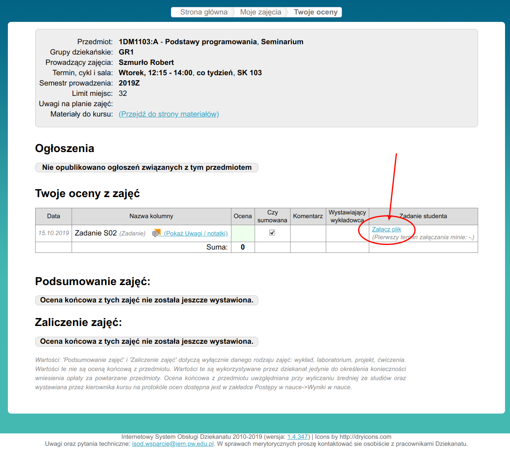

Proszę rozszerzyć program o nazwie drugi.c tak aby wyświetlał na ekranie 
największą wartość liczbową (zmienno przecinkową) podaną jako argument linii komend.

Przykładowo, dla wywołania jak poniżej:

```
./drugi 1.2 5 3 2
```

program powinien wyświetlić:

```
v[0] = 1.200000
v[1] = 5.000000
v[2] = 3.000000
v[3] = 2.000000
Suma = 11.200000
Iloczyn = 36.000000
Maksimum = 5.000000
```

**UWAGA!** Napisany program proszę wgrać do ISODa! Proszę wgrać tylko program źródłowy drugi.c.
To jest sprawdzian czy się uczycie i czy czytacie dokładnie materiały po i przed kolejnymi zajęciami! 
Proszę wejść do ISODa, kliknąć na termin zajęć seminaryjnych w waszym indywidualnym planie zajęć na ISOD, 
oraz proszę kliknąć 'Załącz plik' w wierszu Zadanie S02. Dla tych, którzy zrobia to zadanie na czas czeka 
nagroda w postaci dodatkowych punktów do zalicznia!


